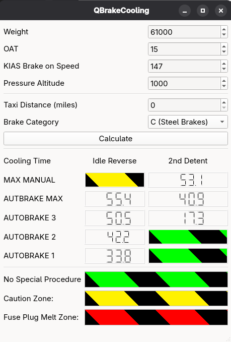
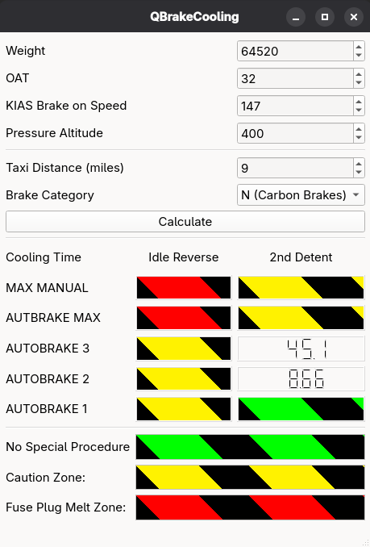

# QBrakeCooling

QBrakeCooling is a lightweight application designed to help pilots, dispatchers, and maintenance technicians quickly estimate **aircraft brake cooling times** after landing or a rejected takeoff.

The tool applies aircraft-specific brake energy formulas and cooling curves to determine when brakes have returned to a safe operating temperature for taxi, turnaround, or takeoff. The result is the brake cooling time in minutes.

**This tool is purely designed for educational purposes and shall not be used for operational purposes.**

## Database
The tool is designed to model brake cooling times for the [Boeing 737](https://en.wikipedia.org/wiki/Boeing_737). However, performance data for this plane is proprietary. The required performance tables for this app to work cannot be bundled and must be obtained seperately. A blank database with the required layout as an example is placed in `/database` 
